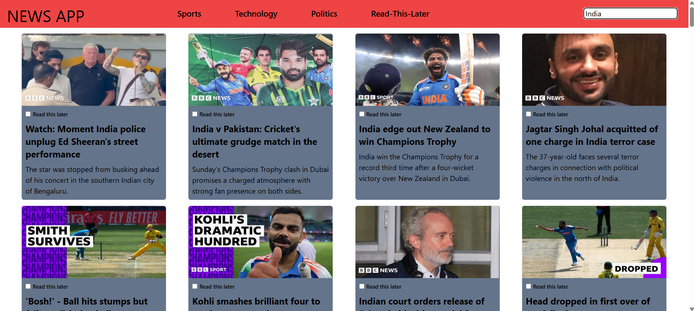

# News Application

This is a news application built with **React.js** that makes use of the **News API** to deliver the latest news updates. The application provides a clean and smooth user interface, allowing users to stay updated on various news topics and manage their favorite articles with ease.

## Features

### 1. News Categories
The application provides news updates on the following topics through the navigation bar:
- **Technology**
- **Sports**
- **Politics**

Clicking on any of these categories will display news related to the selected topic.

### 2. Search Functionality
The application features a **search input** where users can search for news on any topic. The search results are displayed dynamically based on the entered query.

### 3. Read This News Later
Each news item has a **"Read This News Later"** checkbox.
- If the checkbox is selected, the news item is saved to the **"Read This News Later"** page, accessible from the navigation bar.
- Users can view all the saved news articles on this page.
- If the checkbox is unchecked, the news item will be removed from the **"Read This News Later"** page.

## Screenshots

### Sports News Page


### Technology News Page


### Politics News Page


### Searched News Page


### Read This News Later Page


## Installation

Follow these steps to get the application up and running on your local machine:

1. **Clone the repository:**
   ```bash
   git clone https://github.com/yourusername/news-app.git
2. **Navigate to the project directory:**
   cd news-app
3. **Install the dependencies:**
   npm install
4. **Start the application:**
   npm run dev
5. **Open your browser and navigate to:**
   http://localhost:5173

## Technologies Used
- **React.js for building the user interface.**
- **Vite for fast and efficient development.**
- **News API for fetching news articles.**
- **Tailwind CSS for styling.**

## Contributing
Contributions are welcome! Feel free to open issues or submit pull requests to improve the application.
